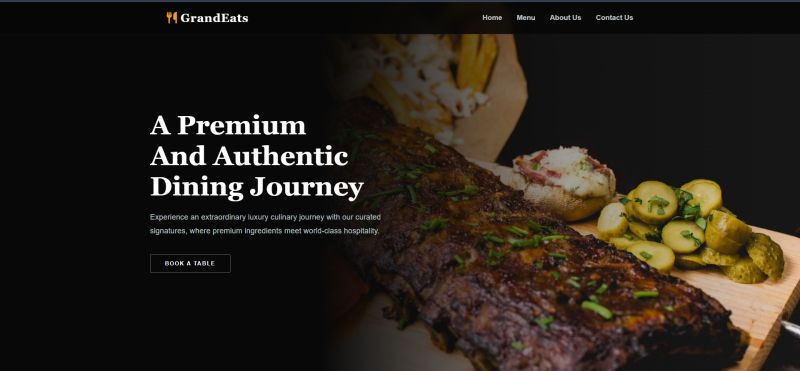

# 🍽️ GrandEats
## Restaurant Table Reservation Platform

A Full-Stack Web Application developed as part of a 1st-Year OOP Module at SLIIT to digitize table bookings, pre-orders, and management workflows.

---

## System Features
* **Role-Based Access Control (RBAC):** Distinct workflows and tailored dashboard interfaces for Registered Customers and System Administrators.
* **Real-time Table Booking:** Interactive scheduling with built-in constraint checking to prevent booking overlaps and double-bookings.
* **Automated Email Notifications:** Asynchronous alert triggers via the Jakarta Mail API for user verification, password resets, and account updates.
* **Admin Control Panel:** Centralized tracking for active reservations, dynamic menu configuration, and exportable business analytics reports.

---

## Tech Stack & Architecture
Designed around a strict **MVC (Model-View-Controller)** pattern without heavy external frameworks.

* **Backend:** Java (Servlets), Maven
* **Frontend:** JSP, HTML5, CSS3, JavaScript, Bootstrap
* **Database:** MySQL
* **Server:** Apache Tomcat

---

## Project Team

* Pawan Madhusara
* Sithmi Pathirana
* Pawani Sathsarani
* Bimasha Gunasekara
* Imaya Shashibhani
* Kaveesha Sathsarani
